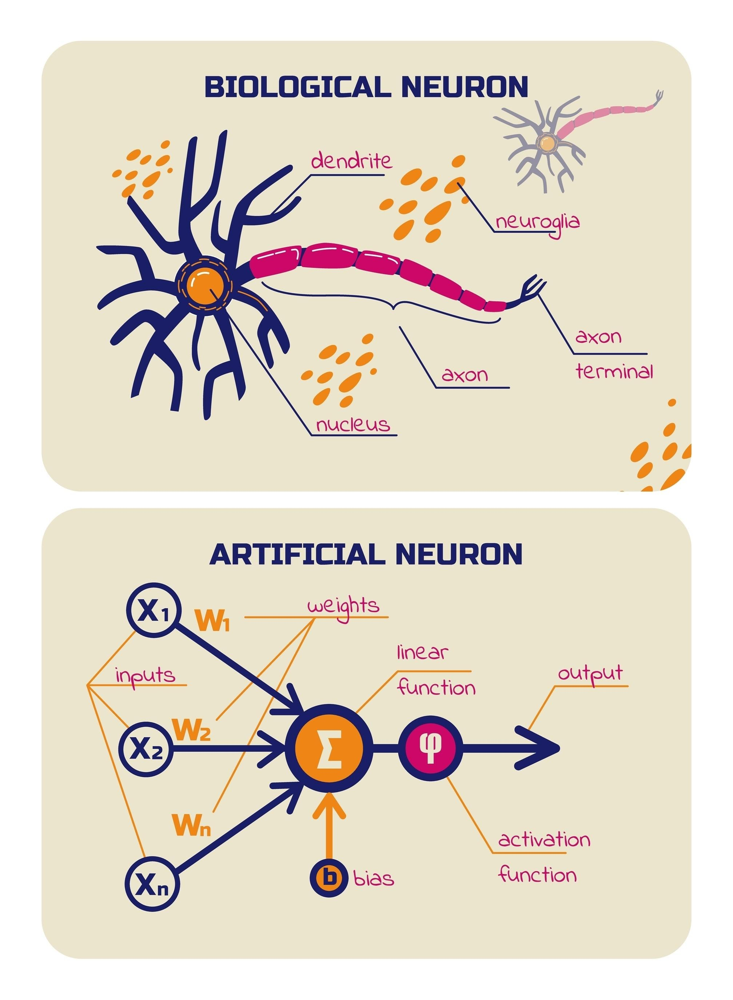

# Tutorial: Redes Neurais Artificiais do Zero

Projeto didático de Rede Neural Artificial (ANN) implementada em Python puro, sem frameworks de machine learning.

A ideia é estudar os fundamentos de:

- neurônio artificial;
- camadas;
- feedforward;
- backpropagation;
- atualização de pesos e `bias`.

Baseado nos conceitos de *Classic Computer Science Problems* (David Kopec).

## Attribution and License

This project is based on the neural network implementation from the book:

**"Classic Computer Science Problems in Python" by David Kopec (2018)**  
Original repository: https://github.com/davecom/ClassicComputerScienceProblemsInPython

The original code is licensed under the Apache License 2.0.  
This project complies with that license and includes proper attribution in all derived files.

### What this project adds

This repository extends the original implementation with:

- Additional activation functions: tanh, ReLU, Leaky ReLU
- Numerical stability improvements (e.g., sigmoid)
- Command-line parameterization
- Unit testing (unittest)
- Modular project structure
- Reproducibility via random seed control

This project should be understood as an **educational extension and adaptation**, not a fully original implementation.

## Guia rápido

- Visão resumida do projeto: [`ann/read.md`](./ann/read.md)
- Este arquivo: explicação completa, matemática e tutorial passo a passo

## Neurônio biológico x neurônio artificial



### Neurônio biológico (ideia intuitiva)

- **Dendritos** recebem sinais.
- **Corpo celular** integra esses sinais.
- **Axônio** transmite a resposta para outros neurônios.

Em resumo: recebe estímulos, combina informações e gera uma resposta.

### Neurônio artificial (no código)

No projeto, um neurônio recebe entradas x₁, x₂, …, xₙ, aplica pesos w₁, w₂, …, wₙ, soma com o viés b e passa por uma função de ativação:

$$
z = \sum_{i=1}^{n} x_i w_i + b
$$

$$
\hat{y} = f(z)
$$

Onde:

- \(z\): combinação linear;
- \(b\): `bias`;
- \(f\): ativação (sigmoid, tanh, relu ou leaky_relu).

## Funções de ativação disponíveis

Implementadas em `ann/Core/util.py`:

1. **Sigmoid**

$$
\sigma(x)=\frac{1}{1+e^{-x}}
$$

$$
\sigma'(x)=\sigma(x)\left(1-\sigma(x)\right)
$$

2. **Tanh**

$$
\tanh(x)=\frac{e^x-e^{-x}}{e^x+e^{-x}}
$$

$$
\frac{d}{dx}\tanh(x)=1-\tanh^2(x)
$$

3. **ReLU**

$$
\text{ReLU}(x)=\max(0,x)
$$

$$
\text{ReLU}'(x)=
\begin{cases}
1, & x>0 \\
0, & x\le 0
\end{cases}
$$

4. **Leaky ReLU**

$$
\text{LeakyReLU}(x)=
\begin{cases}
x, & x>0 \\
\alpha x, & x\le 0
\end{cases}
$$

$$
\text{LeakyReLU}'(x)=
\begin{cases}
1, & x>0 \\
\alpha, & x\le 0
\end{cases}
$$

## Matemática do treinamento (passo a passo)

### 1) Feedforward

Cada camada calcula sua saída e repassa para a próxima:

$$
a^{(l)} = f\!\left(W^{(l)}a^{(l-1)} + b^{(l)}\right)
$$

### 2) Erro na saída

Para cada neurônio de saída, o código usa o erro:

$$
e_j = y_j - \hat{y}_j
$$

### 3) Delta da camada de saída

$$
\delta_j^{(L)} = f'(z_j^{(L)}) \cdot (y_j - \hat{y}_j)
$$

### 4) Delta das camadas ocultas

$$
\delta_i^{(l)} = f'(z_i^{(l)}) \sum_j w_{ij}^{(l+1)}\delta_j^{(l+1)}
$$

### 5) Atualização dos pesos e bias

Para cada peso:

$$
w_{ij} \leftarrow w_{ij} + \eta \cdot a_i^{(l-1)} \cdot \delta_j^{(l)}
$$

Para o bias:

$$
b_j \leftarrow b_j + \eta \cdot \delta_j^{(l)}
$$

Onde \(\eta\) é a taxa de aprendizado (`learning_rate`).

## Modernizações já aplicadas

- `bias` em cada neurônio;
- `sigmoid` numericamente estável;
- novas ativações: `tanh`, `relu`, `leaky_relu`;
- seleção de ativação por parâmetro de linha de comando;
- caminhos de dados robustos com `Path(__file__)`;
- `seed` configurável para reprodutibilidade;
- testes automatizados com `unittest`;
- estrutura de pacotes explícita com `__init__.py`;
- dependências externas não obrigatórias (stdlib).

## Estrutura do projeto

```text
ANN/
├── ann/
│   ├── Core/
│   │   ├── util.py
│   │   ├── neuron.py
│   │   ├── layer.py
│   │   └── network.py
│   ├── data/
│   │   ├── iris.csv
│   │   └── wine.csv
│   ├── examples/
│   │   ├── iris_test.py
│   │   └── wine_test.py
│   └── read.md
├── tests/
│   ├── test_util.py
│   └── test_network.py
└── readme.md
```

## Tutorial de execução (detalhado)

### 1) Pré-requisitos

- Python 3.11+
- terminal na raiz do projeto (pasta que contém `ann/`)

Opcional: ambiente virtual.

```bash
python3 -m venv .venv
source .venv/bin/activate
python -m pip install --upgrade pip
```

### 2) Executar os exemplos

Com parâmetros padrão:

```bash
python -m ann.examples.iris_test
python -m ann.examples.wine_test
```

Com ativação parametrizada:

```bash
python -m ann.examples.iris_test --activation tanh --epochs 60 --seed 42
python -m ann.examples.wine_test --activation relu --epochs 20 --seed 7
python -m ann.examples.iris_test --activation leaky_relu --leaky-alpha 0.05
```

Parâmetros disponíveis nos scripts:

- `--activation`: `sigmoid`, `tanh`, `relu`, `leaky_relu`
- `--epochs`: número de épocas de treino
- `--seed`: semente para aleatoriedade
- `--leaky-alpha`: valor de α da Leaky ReLU

Saída esperada: total de acertos, total de testes e acurácia em porcentagem.

### 3) Executar os testes

Rode toda a suíte:

```bash
python -m unittest discover -s tests -v
```

Como interpretar:

- `ok`: teste passou;
- `FAIL`/`ERROR`: algo precisa ser corrigido;
- no final, o resumo mostra quantos testes foram executados.

## Referência

- [Kopec, David - Classic Computer Science Problems](https://classicproblems.com/)